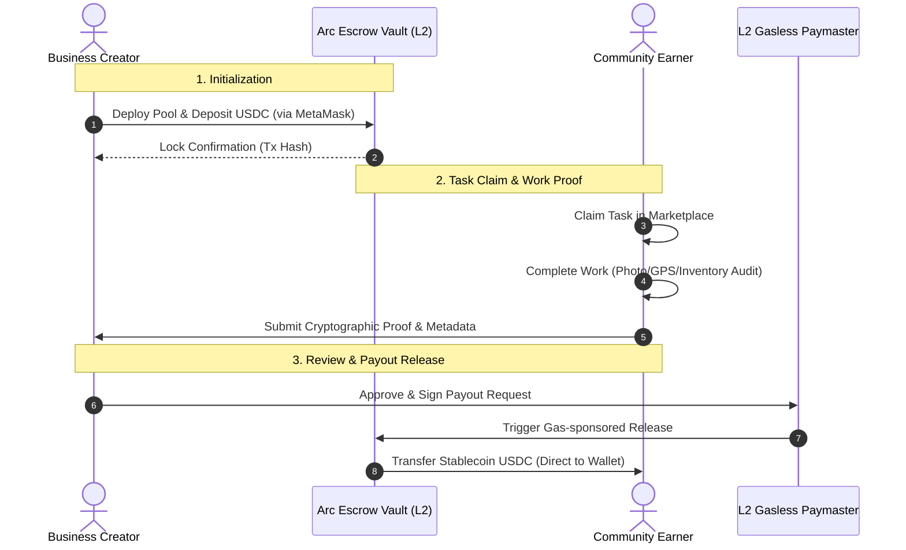

# Jara: Community Commerce Infrastructure

Jara is a decentralized **Community Commerce Infrastructure** powered by stablecoin nanopayments on the **Arc Network**. The platform coordinates and monetizes hyper-local micro-work—such as retail audits, price monitoring, and inventory tracking—which was previously uneconomical to reward due to high L1 transaction fees and coordination friction.

By utilizing gasless Paymaster vaults and off-chain state coordination on the Arc L2 network, Jara connects local businesses directly with community contributors, allowing payments of fraction-of-a-cent scale to settle instantly.

---

## Architecture Overview

Jara is built on a modular client-side framework designed for speed, low bandwidth, and smooth responsive interaction.

---

## Key Features

### 1. Stablecoin Escrow Smart Architecture
Task rewards are secured on-chain using dedicated vaults. 
- **Pool Deployment**: Businesses switch to the *Business Creator* perspective to define task parameters (rewards, limits, rules) and lock USDC pool funds directly from MetaMask.
- **On-Chain Budget Lock**: Funds are locked in the Jara Escrow address on the Arc Testnet.
- **Gasless Release**: When work is approved, the payout is triggered gaslessly for the earner, settling the USDC reward directly to their wallet.

### 2. Multi-Format Task Verification System
Jara provides physical and digital audit tracking widgets to guarantee high-fidelity data collection:
- **Photo Proof**: An interactive drag-and-drop dropzone featuring instant image previews and base64 compression.
- **GPS Location Check-in**: Uses browser Geolocation APIs to query coordinates. Proximity matching checks verify earners are within a `100m` radius of targeted locations (e.g. Balogun Market, Yaba Hub).
- **Inventory Stock Audit**: Interactive worksheets where actual counts are compared to expected stock levels, automatically calculating discrepancy and stock variances.
- **Referral Confirmation**: Cryptographic address validation using regular expression matching to audit referee attributions.
- **Text Surveys**: Monospaced textbox logs for digital polls and feedback verification.

### 3. NanoPay Settlement Engine
A real-time metrics dashboard displaying the macro-economics of the micro-work network:
- **Metrics Tracked**: Active reward pools, settled micro-tasks, total distributed payouts, average reward per action, and active earners.
- **Visual Payment Flow**: An animated progress simulator showing stablecoins streaming from the Business Wallet, locking in the Escrow Smart Vault, and releasing to the Earner.
- **Audited Ledger**: A transaction activity ledger that tracks every settlement hash, time, amount, and explorer link.

### 4. Dynamic Analytics & Earner Dashboard
- **Earnings Summary**: Aggregated earn logs, showing total net revenues in both USD values and `nanoUSDC` (millionths of a dollar).
- **Gamified Achievements**: A dynamically-scaling status indicator leveling up users from *Level 1 Explorer* to *Level 2 Active Contributor* and *Level 3 Local Champion* as they settle tasks.
- **Visual Progress Stack**: Harmonious CSS-based HSL charts that show revenue proportions across local, digital, social, and app testing categories.

---

## Technical Specifications

### Tech Stack
- **Frontend**: Vanilla HTML5, Vanilla CSS3 (Custom design system, variable tokens, Glassmorphism, animations).
- **Logic**: Vanilla ES6 JavaScript (State management, lightweight client-side router, templates, ERC-20 encoders).
- **Icons**: Lucide Web Toolkit.
- **Server**: Static HTTP server structure.

### Blockchain Settings (Arc L2 Network)
Jara communicates with the Arc L2 chain using standard web3 providers (e.g., MetaMask EIP-1193):
*   **Chain ID**: `5042002` (`0x4cef52` hex)
*   **Network Name**: `Arc Testnet`
*   **Native Currency**: `USDC` (18 Decimals native gas / 6 Decimals ERC-20)
*   **RPC Endpoint**: `https://rpc.testnet.arc.network`
*   **Block Explorer**: `https://testnet.arcscan.app`
*   **Arc-USDC Token Address**: `0x3600000000000000000000000000000000000000`
*   **Jara Escrow Address**: `0x3d7ffed295e555052233544ba74eaa1c0920fa20`

### 2. Configure MetaMask
1. Open the MetaMask extension.
2. Click the **Network Selection** dropdown and select **Add Network** -> **Add a network manually**.
3. Input the following details:
   - **Network Name**: `Arc Testnet`
   - **New RPC URL**: `https://rpc.testnet.arc.network`
   - **Chain ID**: `5042002`
   - **Currency Symbol**: `USDC`
   - **Block Explorer URL**: `https://testnet.arcscan.app`
4. Click **Save** and switch your wallet active network to Arc Testnet.

### 3. Acquire Test USDC (Gas & Rewards)
Because USDC is the native gas currency and reward token on Arc, you can request testnet tokens from the faucet:
- Navigate to the **Wallet** tab in Jara or click your connected address to trigger the wallet modal.
- Click **Faucet Drop** or open [faucet.circle.com](https://faucet.circle.com) in your browser.
- Select **USDC** on the **Ethereum Sepolia** network, paste your wallet address, and request funds. The Arc bridge automatically wraps and syncs balances.
